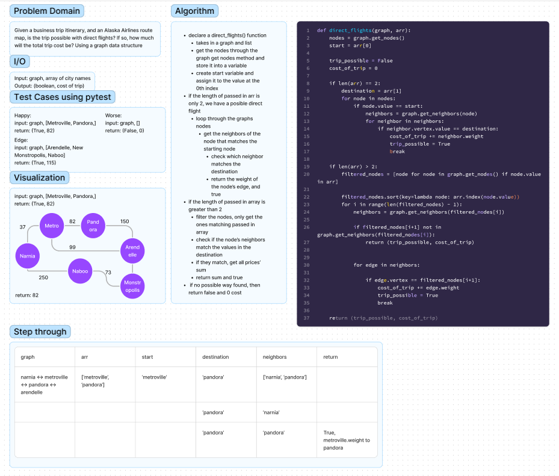

# Graph Business Trip

Given a business trip itinerary, and an Alaska Airlines route map, is the trip possible with direct flights? If so, how much will the total trip cost be?

Write a function called business trip
Arguments: graph, array of city names
Return: the cost of the trip (if it’s possible) or null (if not)

## Whiteboard Process

## Solution

[graph_business_trip.py](graph_business_trip.py)

## Tests

$ pytest tests/code_challenges/test_graph_business_trip.py
