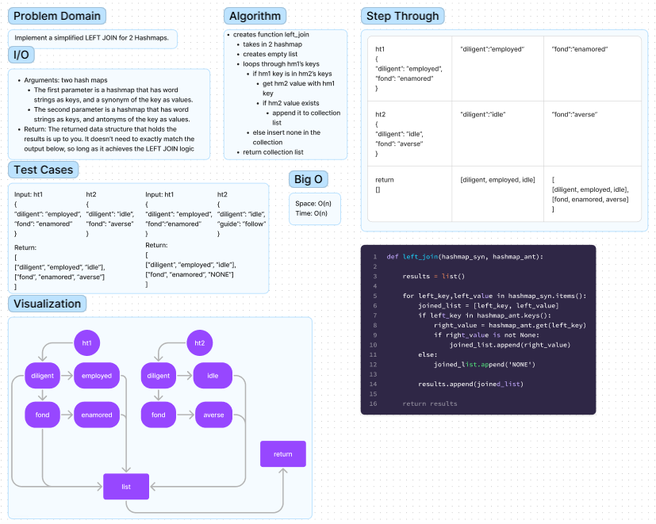

# Hash Table Left Join

Function called left_join.

Arguments: two hash maps
  - The first parameter is a hashmap that has word strings as keys, and a synonym of the key as values.
  - The second parameter is a hashmap that has word strings as keys, and antonyms of the key as values.
  -
Return: The returned data structure that holds the results is up to you. It doesn’t need to exactly match the output below, so long as it achieves the LEFT JOIN logic

## Whiteboard

## Solution

[hashtable_left_join.py](hashtable_left_join.py)

## Tests

$ pytest tests/code_challenges/hashtable_left_join.py
