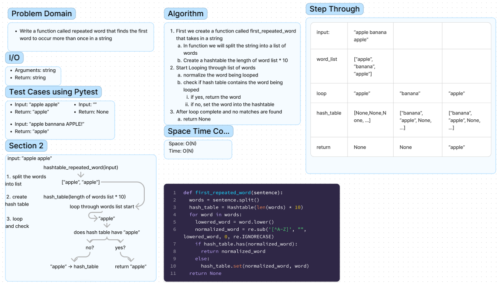

# Hashtable Repeated Word

## Whiteboard Process



## Approach & Efficiency

The approach I took for this function is to split the sentence into a list so we can effectively deal with each word
separately.

I create a hash table that is 10 times the length of the list we created.

loop through that list of words, normalizing each word.

Then do a conditional check to see if the word is already in the hashtable.

If it is not, we add it to the hashtable

If it is, then we return that word.

Because we have to create a list and a hashtable, the Space and time complexity is:
O(N)

## Solution

```python
def first_repeated_word(sentence):
    words = sentence.split()
    hash_table = Hashtable(len(words) * 10)
    for word in words:
        lowered_word = word.lower()
        normalized_word = re.sub('[^A-Z]', "", lowered_word, 0, re.IGNORECASE)
        if hash_table.has(normalized_word):
            print('has', normalized_word)
            return normalized_word
        else:
            hash_table.set(normalized_word, word)
    return None
```
