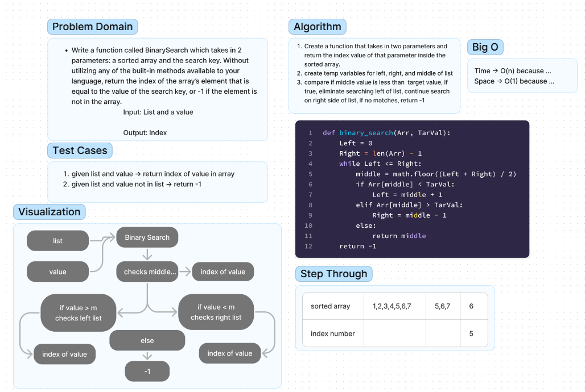

# List Binary Search

Write a function called ```BinarySearch``` which takes in 2 parameters: a sorted array and the search key. Without utilizing any of the built-in methods available to your language, return the index of the array’s element that is equal to the value of the search key, or -1 if the element is not in the array.

## Whiteboard Process



## Approach & Efficiency

The approach that we took on this code challenge without utilizing too many built in functions was to create an empty list inside of the function. 

We then would need to find the middle of the list using len().

With that middle index we could insert the start to the middle of the argument list to the empty list, append the argument value after, then append the rest of the argument list to the empty list.

With that logic, we would return the argument list with the value inserted into the middle.

The time complexity of this function is O(n), where n is the length of the input list, and the space complexity is O(n), due to the creation of a new list with n/2 elements.

The temporary variables created in the function, 'middle' and 'newList' all take constant time so they can be ignored. 


## Solution
...in progress
<!-- Show how to run your code, and examples of it in action -->