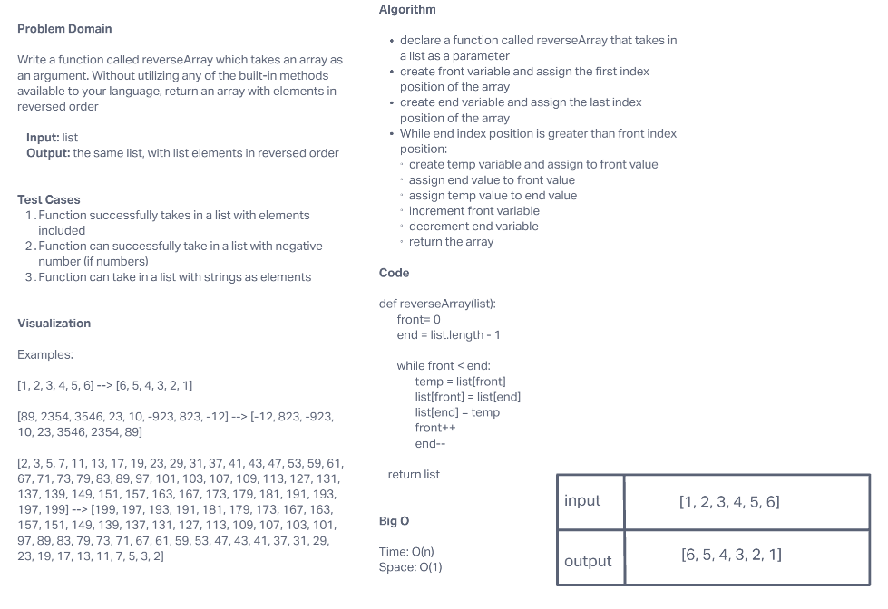

# List Reverse

Create a function called ```reverseList``` which takes in a list as an argument. And without utilizing any of the built-in methods available, return an array with elements in the reversed order

## Whiteboard Process



## Approach & Efficiency

The approach that we took was to create 3 variables, one for the front index of the list, one for the end index of the list and a temporary variable that would hold the front element in the list. 

We then created a while loop that will run while the front index is less than the end index. 

In that while loop, we create and assign a temp variable to the element in the front of the list, then assign the value from the end of the list to the front of the list, then assign the temp value holding the front value to the end of the list, incrementing the front and end index during each iteration.

Finally, we return the list.

The time complexity of this function is O(n) and the space complexity is O(1), where n is the length of the input array, because it reverses the array in-place using a while loop that iterates n/2 times.

## Solution
...in progress
<!-- Show how to run your code, and examples of it in action -->