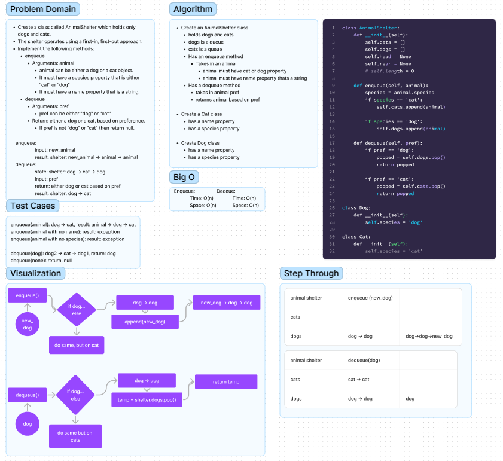

# Animal Shelter

Create a class called AnimalShelter which holds only dogs and cats.
The shelter operates using a first-in, first-out approach.

- Implement the following methods:
    - enqueue()
      - Arguments: animal
      - animal can be either a dog or a cat object.
      - It must have a species property that is either "cat" or "dog"
      - It must have a name property that is a string.

    - dequeue
      - Arguments: pref
      pref can be either "dog" or "cat"
      - Return: either a dog or a cat, based on preference.
      - If pref is not "dog" or "cat" then return null.

## Whiteboard Process



## Approach & Efficiency

Enqueue:
For this function, I used a list to append the new animal to the 'front' of an animal list depending on the type of animal it is

Time: O(1), because we are just pushing 1 value into the stack
Space: O(n), because depending on the number of elements in the queue, we can hold up to
n elements

Dequeue:
For this function, I used a list to pop the front of the list off.

Time: O(n), the method needs to move n elements based on the stack.
Space: O(n), depends on n elements in the stack

## Solution
to run the code just enter
```  python3 -m code_challenges.stack_queue_pseudo ```
into the terminal.

To create an AnimalShelter:
```python
shelter = AnimalShelter()
```
To add a new animal to a specific list()
```python
shelter.enqueue(animal)
```
To remove an animal based on its species from the shelter:
```python
shelter.dequeue('dog')
```

