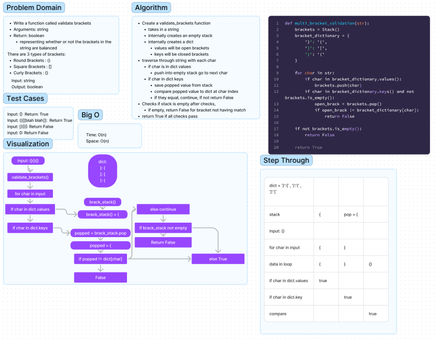

# Stack Queue Brackets

Write a function called validate brackets

Arguments: string

Return: boolean
  - representing whether or not the brackets in the string are balanced

There are 3 types of brackets:
- Round Brackets : ()
- Square Brackets : []
- Curly Brackets : {}

## Whiteboard Process



## Approach & Efficiency

The approach that I took for this was to create a stack and a dictionary. This dictionary would match opening
brackets to their closing brackets with a key value pair.

This function will iterate through each character in the input string and if there is a match to the opening bracket
in the dictionary, it will push it to the stack then continue to check the other characters.

once it finds another bracket in the input string, it compares it to the bracket in the stack if it matches continue,
if not then return false and stop checking.

Time: O(n), n is the length of the input string.
Space: O(n), n is the size of the stack that will be pushing and popping values based on the bracket matches

## Solution
to run the code just enter
```  python3 -m code_challenges/stack_queue_brackets.py ```
into the terminal.


