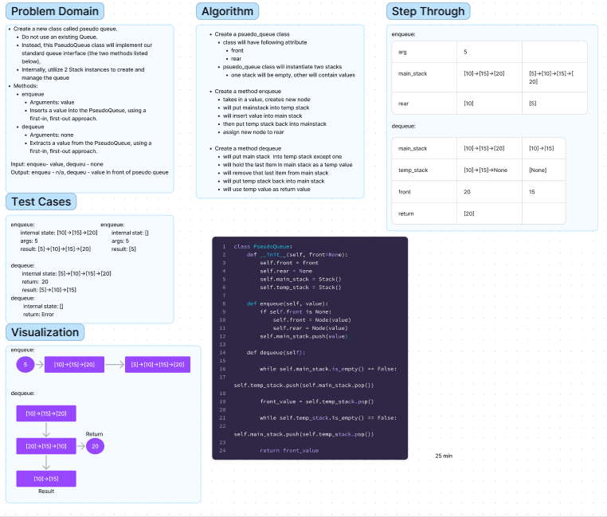

# PseudoQueue

Create a new class called pseudo queue.
 - Do not use an existing Queue.
 - Instead, this PseudoQueue class will implement our standard queue interface (the two methods listed below),
 - Internally, utilize 2 Stack instances to create and manage the queue
Methods:

- enqueue()
  - Arguments: value
  - Inserts a value into the PseudoQueue, using a first-in, first-out approach.
- dequeue()
  - Arguments: none
Extracts a value from the PseudoQueue, using a first-in, first-out approach.

## Whiteboard Process



## Approach & Efficiency

Enqueue:
For this function, I approached it just like a line. I add a new value to the rear of the pseudo queue.

Time: O(1), because we are just pushing 1 value into the stack
Space: O(n), because depending on the number of elements in the queue, we can hold up to
n elements

Dequeue:
For this function I approached it like having two piles of plates. When I move stack1 to stack2, its moved from the
top so its in the bottom of stack2. Once moved, I take the bottom of stack2, save it in a vallue, then send it
back to
stack1.

Time: O(n), the method needs to move n elements based on the stack.
Space: O(n), depends on n elements in the stack


## Solution
to run the code just enter
```  python3 -m code_challenges.stack_queue_pseudo ```
into the terminal.

To create a Stack:
```python
new_pq = PseudoQueue()
```
To add a new node at the end of a PseudoQueue:
```python
new_pq.enqueue('apple')
```
To remove a node from the front of a PseudoQueue:
```python
new_pq.dequeue()
```

