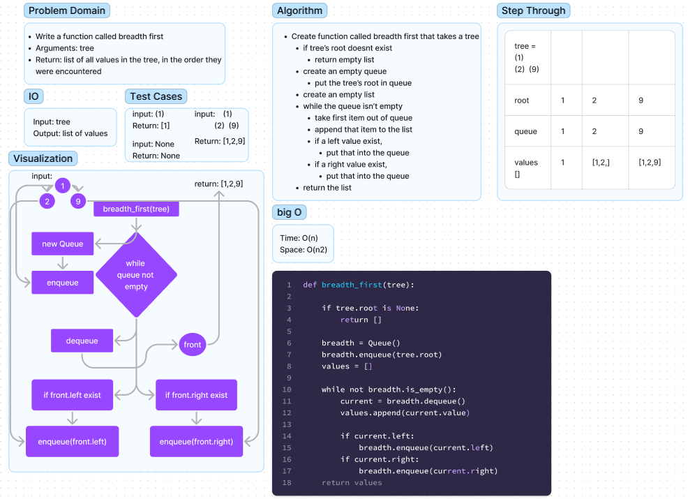

# Tree Breadth First Search

Write a function called breadth first.
Uses a Queue and list to search and collect all values from a Binary Tree according to
occurence

- breadth_first()
  - Arguments: tree
  - Return: list of all values in the tree, in the order they were encountered


## Whiteboard Process



## Approach & Efficiency

The time complexity of this function is O(n), where n is the number of nodes in the tree. This is because each node is visited exactly once during the breadth-first traversal.

The space complexity of the function is O(w), where w is the maximum width of the tree (i.e., the maximum number of nodes at any level). This is because at any given time, the queue will contain at most w nodes (the nodes at the current level of the tree), and each node takes up O(1) space. Therefore, the space complexity of the function is proportional to the maximum width of the tree.


## Solution
to run the code just enter
```  python3 -m code_challenges.tree_breadth_first.tree_breadth_first ```
into the terminal.

To create a BinaryTree:
```python
tree = BinaryTree()
```
To add a new node to the root of BinaryTree:
```python
tree.root = Node("a")
```

To perform breadth_first() search:
```python
breadth_first(tree)
```

