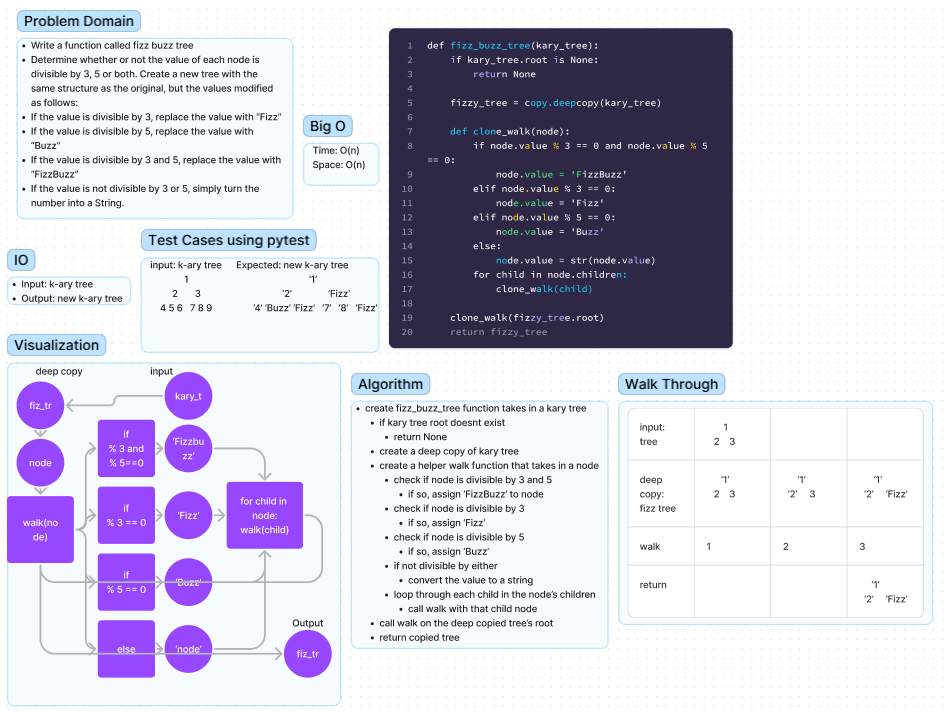

# K-Ary Tree Fizz Buzz

## Whiteboard Process



## Approach & Efficiency

The time complexity of this code is O(n), where n is the number of nodes in the input k-ary tree.

The reason is that the code performs a depth-first traversal of the entire k-ary tree and processes each node once. The process of checking the node's value and changing it to the appropriate string takes constant time. Therefore, the time complexity of the entire code is proportional to the number of nodes in the input tree, which is O(n).

The use of the deepcopy function from the copy module creates a new copy of the input tree, but it does not affect the time complexity of the code as it only occurs once at the beginning of the function.

In terms of space complexity, the code creates a new copy of the k-ary tree using deepcopy, which requires additional memory proportional to the size of the input tree, which is also O(n). The recursive function call is tail-recursive, so the space complexity is O(k), where k is the maximum number of children of any node in the input tree.


## Solution
to run the code just enter
```  python3 -m code_challenges.tree_fizz_buzz.tree_fizz_buzz ```
into the terminal.

To create Nodes for KaryTree:
```python
one.children = [two, three]
two.children = [four, five, six]
three.children = [seven, eight, nine]
```

To create a KaryTree:
```python
tree = KaryTree(one)
```

To perform breadth_first() search and display a list of values:
```python
tree.breadth_first()
```

