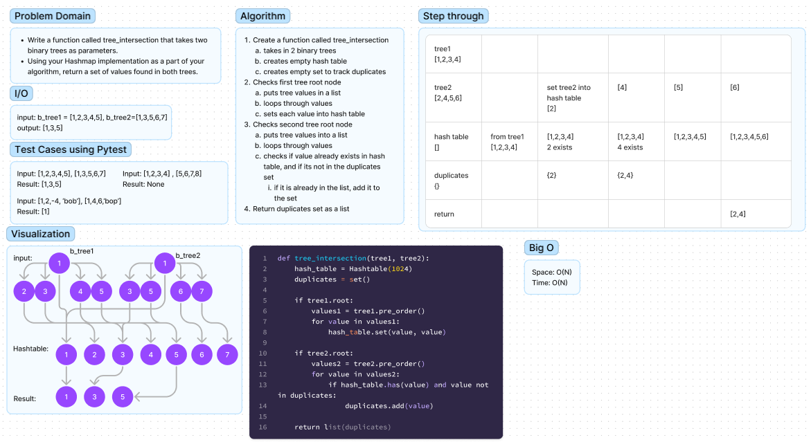

# Tree Intersection

Uses a function that takes two binary trees as parameters.
Uses a hashmap/hash table in algorithm to find values that occur in both trees.
returns duplicates.

## Whiteboard

## Solution

[tree_intersection.py](tree_intersection.py)

## Tests

$ pytest tests/code_challenges/test_tree_intersection.py
