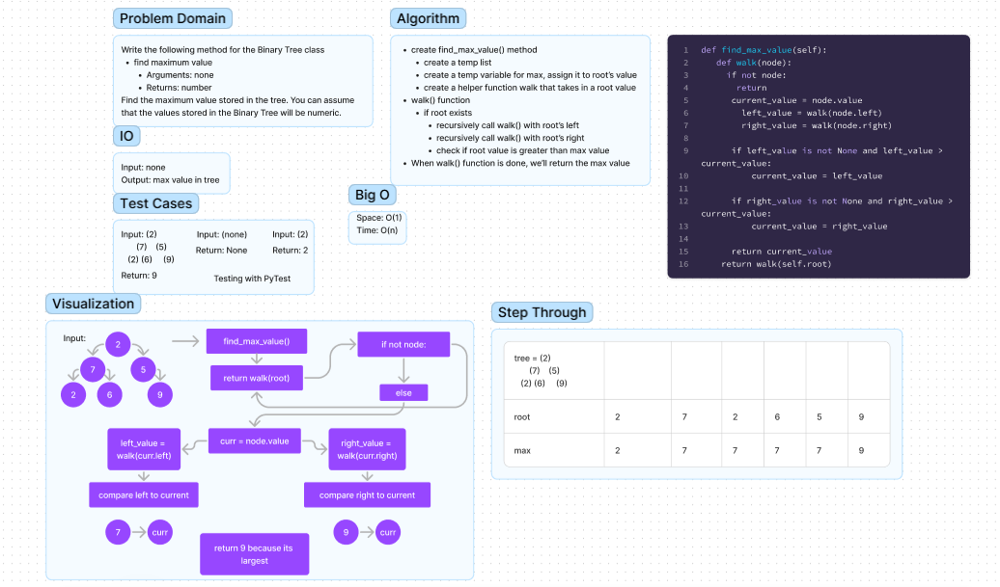

# Binary Tree

### Node
Create a Node class that has properties for the value stored in the node, the left child node, and the right child node.

### Binary Tree
Create a Binary Tree class
- Define a method for each of the depth first traversals:

  - pre order()
    - root >> left >> right

  - in order()
    - left >> root >> right

  - post order()
    - left >> right >> root

  - Each depth first traversal method should return an array of values, ordered appropriately.

  - find_maximum_value()
    - Arguments: none
    - Returns: number
    - Find the maximum value stored in the tree. You can assume that the values stored in the Binary Tree will be numeric.


## Whiteboard Process



## Approach & Efficiency

Because of the lack of organizational structure in a Binary Tree, the worst case for most operations will involve
traversing the entire tree. If we assume that a tree has n nodes, then in the worst case we will have to look at n
items, hence the O(n) complexity.

The time and space complexity for traversing the binary tree in a depth first method:
Time: O(N)
Space: O(N)

## Solution

to run the code just enter
```   python3 -m data_structures.binary_tree.binary_tree ```
into the terminal.

To create a BinaryTree:
```python
tree = BinaryTree()
```
To add a new node to the root of BinaryTree:
```python
tree.root = Node("a")
```
To traverse, search and print the BinaryTree in pre-order method:
```python
tree.pre_order()
```
To traverse, search and print the BinaryTree in in-order method:
```python
tree.in_order()
```

To traverse, search and print the BinaryTree in post-order method:
```python
tree.post_order()
```

To find the maximum value in a BinaryTree:
```python
tree.find_maximum_value()
```
