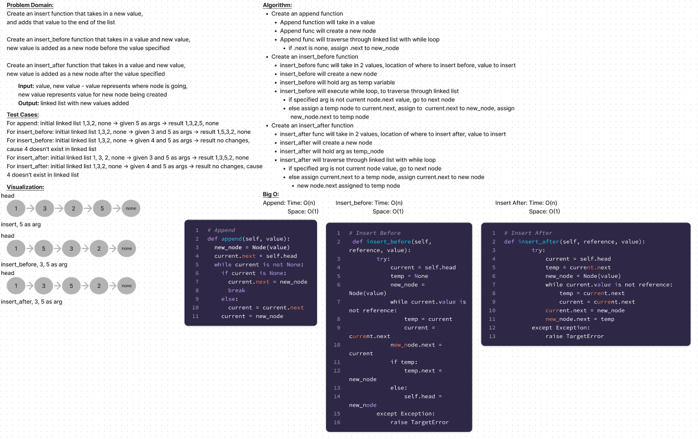

# Linked Lists Insertions

### Linked List Insertion Methods
Write the following methods for the Linked List class:

- append
  - arguments: new value
  - adds a new node with the given value to the end of the list

- insert before
  - arguments: value, new value

  - adds a new node with the given new value immediately before the first node that has the value specified

- insert after

  - arguments: value, new value

  - adds a new node with the given new value immediately after the first node that has the value specified

## Whiteboard Process



## Approach & Efficiency

I took a TDD approach towards creating the linked list insertion methods.

In order to get these methods to work I had to somehow 'juggle' the nodes already
inside of the linked list. I apprached this by using temp variables that would hold
the values of the surrounding nodes and inserting a value between the specified
location

The time complexity of these functions are O(n) and the space complexity is O(1)

## Solution

to run the code just enter
``` python linked_list/linked_list.py ```
into the terminal.

To create a linked list:
```python
new_linked = LinkedList()
```
To append a node into a linked list:
```python
new_linked.append('apple')
```
To insert after a value in linked list:
```python
new_linked.insert_after('point of entry', 'node to be inserted')
```
To check before a value in linked list:
```python
new_linked.insert_before('point of entry', 'node to be inserted')
```
