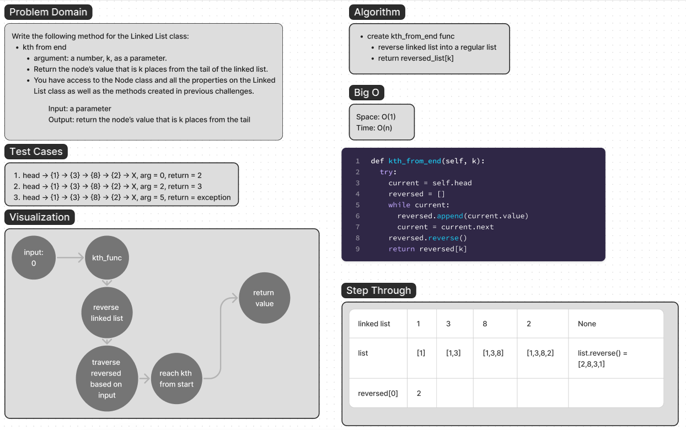

 - [ ] Top-level README “Table of Contents” is updated
 - [ ] README for this challenge is complete
       - [ ] Summary, Description, Approach & Efficiency, Solution
       - [ ] Picture of whiteboard
       - [ ] Link to code
 - [ ] Feature tasks for this challenge are completed
 - [ ] Unit tests written and passing
       - [ ] “Happy Path” - Expected outcome
       - [ ] Expected failure
       - [ ] Edge Case (if applicable/obvious)

# Linked Lists Kth

Write the following method for the Linked List class:

- kth from end
  - argument: a number, k, as a parameter.
  - Return the node’s value that is k places from the tail of the linked list.
  - You have access to the Node class and all the properties on the Linked List
  class as well as the methods created in previous challenges.

## Whiteboard Process



## Approach & Efficiency

The approach that I took for this problem was to create an empty list,
traverse through each node in the linked list and append that node's value
to the empty list.

Once that is done, I reverse the list and return the index location of the passed in argument
in the reversed list.

Space: O(1)
Time: O(N)

## Solution

```python
    def kth_from_end(self, k):
        try:
            if k < 0:
                raise TargetError
            else:
                current = self.head
                reversed = []
                while current:
                    reversed.append(current.value)
                    current = current.next
                reversed.reverse()
                return reversed[k]
        except Exception:
            raise TargetError

```

