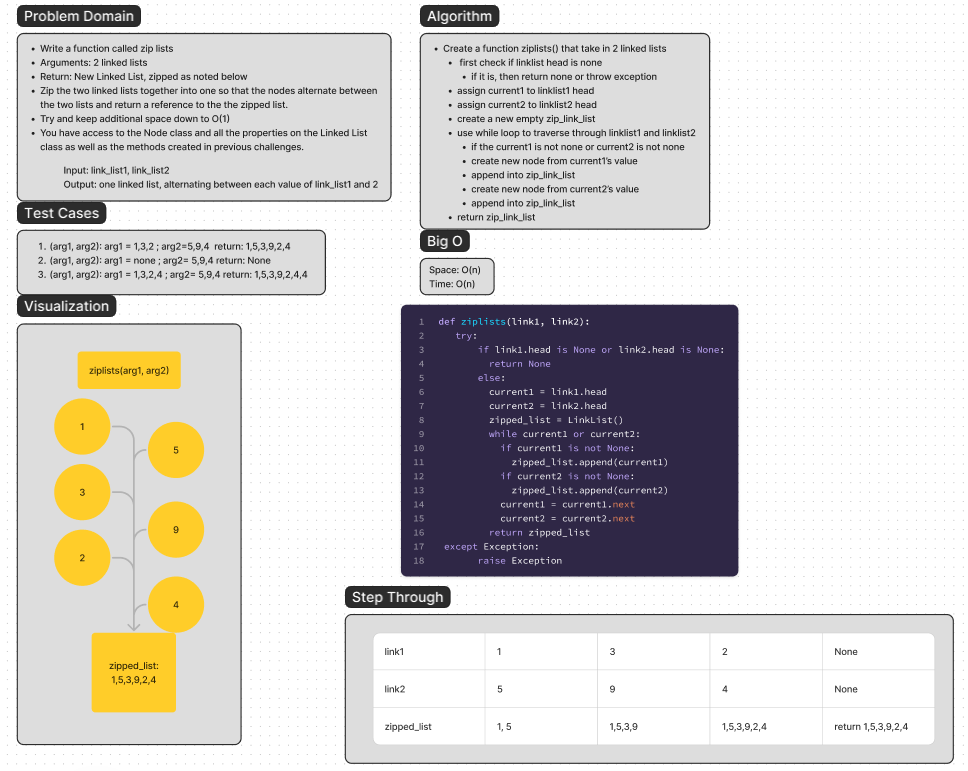

# Linked Lists Kth

Write a function called zip lists
Arguments: 2 linked lists
Return: New Linked List, zipped as noted below
Zip the two linked lists together into one so that the nodes alternate between the two lists and return a reference to the the zipped list.
Try and keep additional space down to O(1)
You have access to the Node class and all the properties on the Linked List class as well as the methods created in previous challenges.

## Whiteboard Process



## Approach & Efficiency

The approach that I took for this issue was to first, create a new linked list, then keep track of the current
head for the two arguments. With those I traverse through each linked list at the
same
time, and during
each
traversal I use the append method to the new linked list created. Finally I return the completed linked list

Space: O(N)
Time: O(N)

## Solution

```python
    @staticmethod
    def zip_lists(list_a, list_b):
        try:
            new_list = LinkedList()
            current_a = list_a.head
            current_b = list_b.head

            while current_a is not None and current_b is not None:
                new_list.append(current_a.value)
                new_list.append(current_b.value)
                current_a = current_a.next
                current_b = current_b.next

            # Add any remaining nodes from list_a
            while current_a is not None:
                new_list.append(current_a.value)
                current_a = current_a.next

            # Add any remaining nodes from list_b
            while current_b is not None:
                new_list.append(current_b.value)
                current_b = current_b.next

            return new_list
        except Exception:
            raise Exception

```
